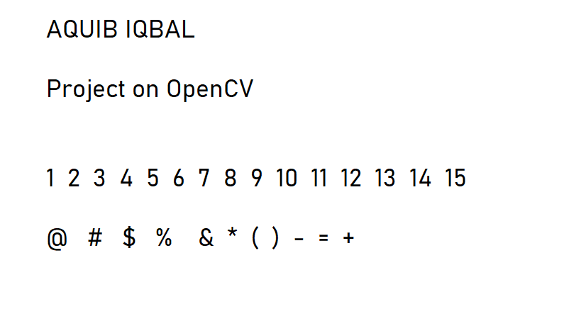
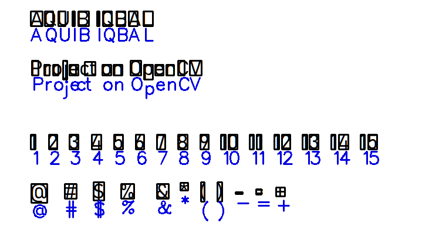
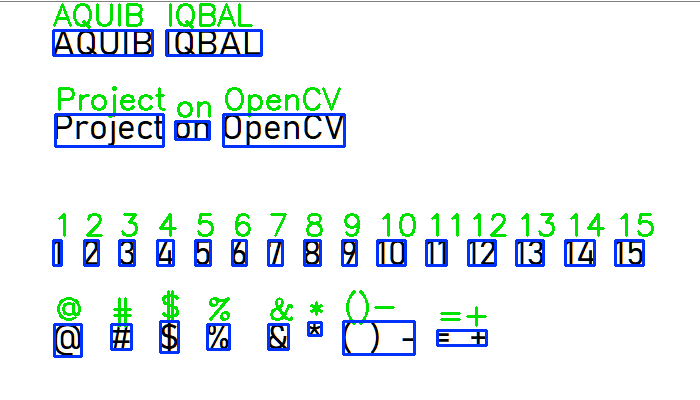

# Text-Detection

Text detection using open source OCR Tesseract and OpenCV for Computer Vision.

Requires Installation https://tesseract-ocr.github.io/tessdoc/Home.html.

## Input image

## Output Images

### Character

### Word

